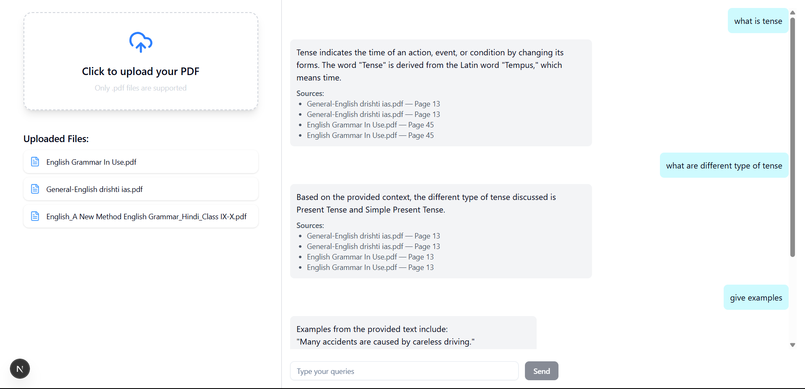

# AskMyPDF

Interact with any PDF—ask questions, get page-specific answers, and explore documents smarter.

A full-stack application that allows users to upload PDF documents and chat with them using AI. The application processes PDFs, creates vector embeddings, and enables intelligent question-answering based on the document content.

## Features

- **PDF Upload**: Upload PDF documents through an intuitive drag-and-drop interface
- **Document Processing**: Automatic text extraction and chunking from PDFs using LangChain
- **Vector Search**: Semantic search using embeddings stored in Qdrant vector database
- **AI Chat**: Chat with your documents using Google's Gemini AI model
- **Source Citations**: Get page-specific references for all answers
- **Real-time Processing**: Background job processing with BullMQ and Redis
- **Responsive UI**: Clean, modern interface built with Next.js and Tailwind CSS

## UI


*Upload PDFs on the left, chat with your documents on the right*

## Tech Stack

### Frontend
- **Next.js 14** - React framework with App Router
- **TypeScript** - Type-safe development
- **Tailwind CSS** - Utility-first CSS framework
- **Shadcn/ui** - UI component library
- **React Markdown** - Markdown rendering for chat messages
- **Sonner** - Toast notifications

### Backend
- **Bun** - JavaScript runtime and package manager
- **Hono** - Fast web framework
- **LangChain** - Document processing and AI orchestration
- **Google Gemini AI** - Language model for chat responses
- **Qdrant** - Vector database for embeddings
- **BullMQ** - Job queue for background processing
- **Redis** - Message broker and caching

## Prerequisites

Before running this application, make sure you have the following installed:

- [Bun](https://bun.sh/) (latest version)
- [Node.js](https://nodejs.org/) (v18 or higher)
- [Docker](https://www.docker.com/) (for Qdrant and Redis)
- [Google AI API Key](https://makersuite.google.com/app/apikey)

## Installation

### 1. Clone the Repository

```bash
git clone https://github.com/Ritikchauhan1704/AskMyPDF
cd AskMyPDF
```

### 2. Install Dependencies

**Frontend:**
```bash
cd frontend
bun install
```

**Backend:**
```bash
cd backend
bun install
```

### 3. Environment Setup

**Frontend (.env.local):**
```env
NEXT_PUBLIC_SERVER_URL=http://localhost:8080
```

**Backend (.env):**
```env
GOOGLE_API_KEY=your_google_ai_api_key_here
PORT=8080
```

### 4. Start Required Services

**Start Qdrant (Vector Database) and Redis (Job Queue):**
```bash
docker run docker compose up -d
```


## Running the Application

### 1. Start the Backend Services

**Start the API server:**
```bash
cd backend
bun dev
```

**Start the background worker (in a new terminal):**
```bash
cd backend
bun run dev:worker
```

### 2. Start the Frontend

```bash
cd frontend
bun dev
```

The application will be available at:
- Frontend: http://localhost:3000
- Backend API: http://localhost:8080
- Qdrant Dashboard: http://localhost:6333/dashboard

## Usage

1. **Upload a PDF**: Click on the upload area and select a PDF file
2. **Wait for Processing**: The document will be processed and embedded in the background
3. **Start Chatting**: Ask questions about your PDF in the chat interface
4. **View Sources**: Each answer includes references to specific pages in your document

## API Endpoints

### POST /upload/pdf
Upload a PDF file for processing.

**Request:**
- Method: POST
- Content-Type: multipart/form-data
- Body: PDF file with key "pdf"

**Response:**
```json
{
  "message": "File uploaded successfully",
  "filename": "document.pdf"
}
```

### GET /chat?q={query}
Chat with uploaded documents.

**Request:**
- Method: GET
- Query Parameters: `q` - The user's question

**Response:**
```json
{
  "answer": "AI-generated answer based on document content",
  "matchedChunks": [
    {
      "chunk": 1,
      "metadata": {
        "source": "document.pdf",
        "pageNo": 5
      }
    }
  ]
}
```

## Project Structure

```
askmypdf/
├── frontend/
│   ├── components/
│   │   ├── Chat.tsx          # Chat interface component
│   │   ├── FileUpload.tsx    # PDF upload component
│   │   └── ui/               # Shadcn/ui components
│   ├── app/
│   │   ├── page.tsx          # Main page
│   │   └── layout.tsx        # Root layout
│   └── package.json
├── backend/
│   ├── src/
│   │   ├── app.ts            # Hono app configuration
│   │   └── worker.ts         # Background job processor
│   ├── uploads/              # PDF storage directory
│   |── package.json
|   ├── index.ts          # Server entry point
│   │   
└── README.md
```

## How It Works

1. **Upload**: User uploads a PDF file through the frontend
2. **Storage**: File is saved to the `uploads/` directory
3. **Job Queue**: Upload triggers a background job in BullMQ
4. **Processing**: Worker extracts text, splits into chunks, and creates embeddings
5. **Vector Storage**: Embeddings are stored in Qdrant with metadata
6. **Chat**: User questions are embedded and matched against stored vectors
7. **Response**: Gemini AI generates answers based on relevant document chunks

## Configuration

### Chunking Parameters
Adjust text splitting in `worker.ts`:
```typescript
const splitter = new CharacterTextSplitter({
  chunkSize: 500,        // Size of each text chunk
  chunkOverlap: 50,      // Overlap between chunks
});
```

### Retrieval Parameters
Modify search results in `app.ts`:
```typescript
const retriever = vectorStore.asRetriever({ k: 4 }); // Number of chunks to retrieve
```
